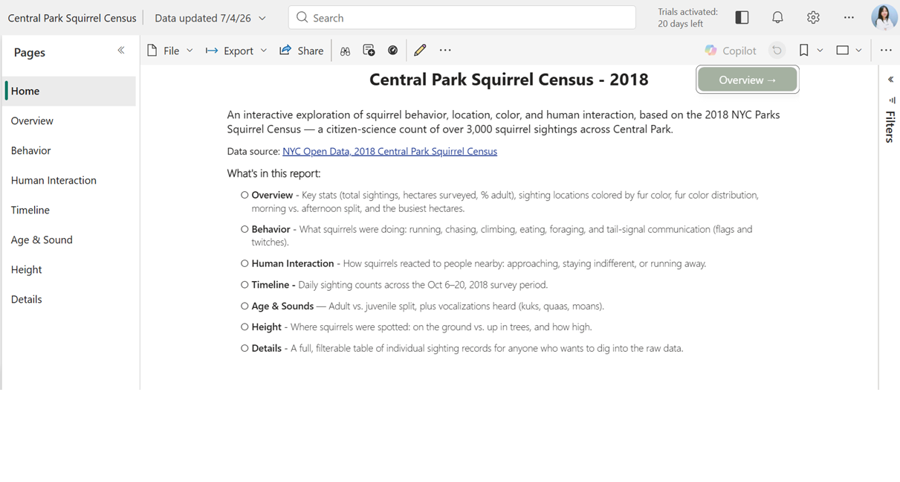
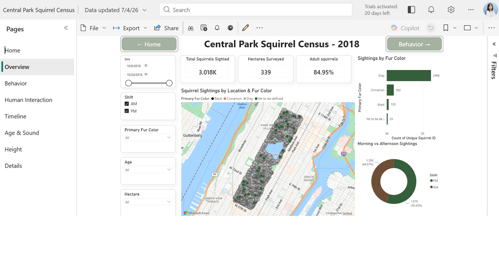
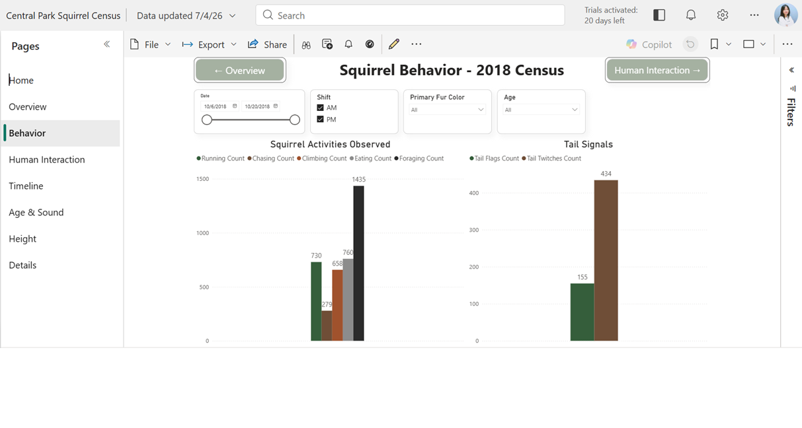
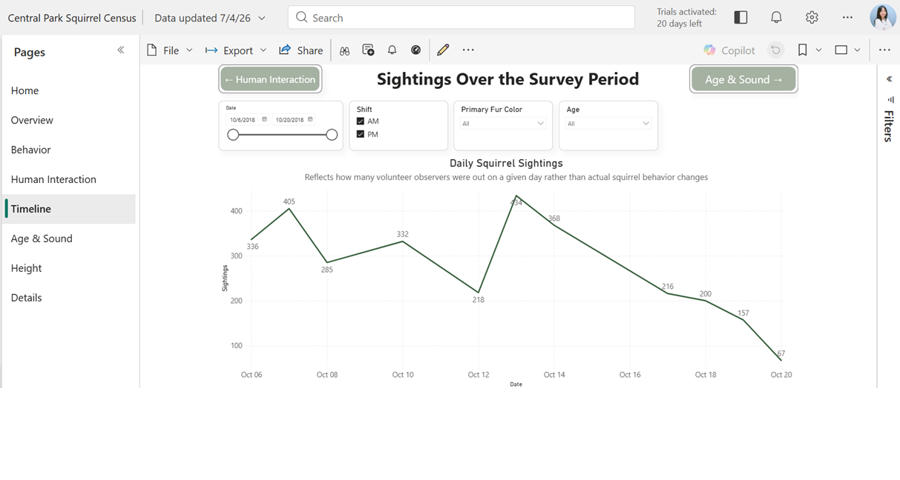
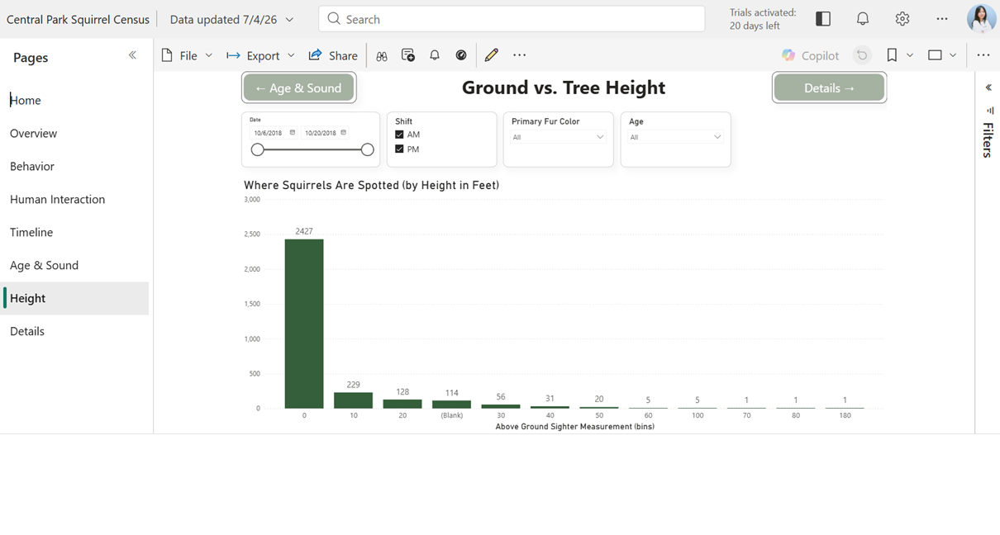
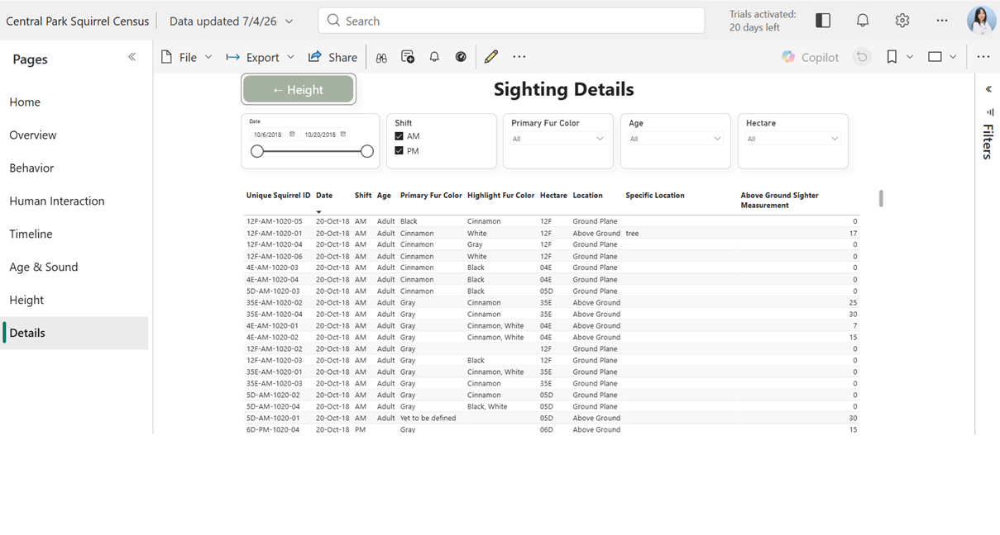

### Central Park Squirrel Census — Power BI Portfolio Project

A Power BI dashboard exploring patterns in squirrel color, behavior, and location from the 2018 Central Park Squirrel Census.

#### Data Source

- Raw data: [2018 Central Park Squirrel Census - Squirrel Data](https://data.cityofnewyork.us/Environment/2018-Central-Park-Squirrel-Census-Squirrel-Data/vfnx-vebw), NYC Open Data
- Via Kaggle: [Squirrel Data Insights](https://www.kaggle.com/datasets/ranaghulamnabi/2018-central-park-squirrel-data-insights)

#### Screenshots

**Home**

**Overview**

**Behavior**

**Human Interaction**

**Timeline**

**Age & Sounds**

**Height**

**Details**

#### Contents

- `data/` — raw CSV data
- `squirrel_dashboard.pbix` — Power BI report

#### Dashboard

Download `squirrel_dashboard.pbix` and open it in [Power BI Desktop](https://www.microsoft.com/en-us/power-platform/products/power-bi/desktop) (free) to explore the full interactive report.